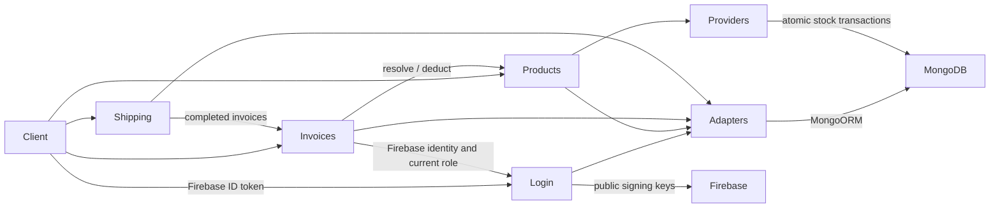

# Gin Products microservices backend

Repository: [geometry-software/gin-products](https://github.com/geometry-software/gin-products).

A Go/Gin backend based on the service boundaries and `apps/`
layout of [geometry-software/nx-react-nestjs](https://github.com/geometry-software/nx-react-nestjs).
Six independently runnable processes, one Go module, no frontend and no Node.js/Nx dependency.

| Service | Local port | Owns |
| --- | ---: | --- |
| [Login](apps/login/README.md) | 3001 | Firebase ID token verification and public user directory |
| [Products](apps/products/README.md) | 3002 | Catalog and available stock |
| [Shipping](apps/shipping/README.md) | 3004 | Delivery snapshots and tracking state |
| [Invoices](apps/invoices/README.md) | 3005 | Billing snapshots, invoice-only JWTs and role checks |
| [Adapters](apps/adapters/README.md) | 3006 | MongoORM infrastructure endpoints |
| [Providers](apps/providers/README.md) | 3007 | Registered providers and stock transactions |



## Run on localhost

### Native Go with `.env`

This checkout has a private `.env` with the supplied MongoDB credentials and
`FIREBASE_PROJECT_ID`, plus `APP_JWT_SECRET` for Invoices and `INTERNAL_API_KEY` for
internal HTTP routes. It is ignored by Git and excluded from the Docker build
context. The supplied `JWT_SECRET` is retained but is not used by these services.

Go 1.26+ is required; this checkout has Go 1.27.1 installed under `.tools/go`.
Make automatically uses that installation when present, otherwise `go` from PATH.
On a fresh checkout, install Go from [go.dev/dl](https://go.dev/dl/) and provide
your own private `.env` with the five MongoDB URIs, `FIREBASE_PROJECT_ID`,
`APP_JWT_SECRET` and `INTERNAL_API_KEY`. Python 3 is needed for startup timing;
`make start` also uses curl to wait for readiness and `lsof` to free occupied
service ports.

```bash
make deps
make start
```

`make start` builds all six binaries and runs them as separate processes. The
console prints the start time, each service's launch offset, readiness URL, HTTP
status and response time, then the completion time and its difference from the
start to 0.1 seconds. Timestamps include milliseconds. It waits for every `/readyz`
endpoint (up to 90 seconds by default; set `STARTUP_TIMEOUT_SECONDS` to change it).
Logs are in `logs/<service>.log`; Ctrl+C stops every process. If any process exits,
the supervisor stops the others. All native services bind to `127.0.0.1` by default.
Keep the `make start` terminal open while using the API. Before each start, the
script uses `lsof` to find and stop processes listening on the six configured
ports, waits for those ports to become free, and then starts the services. This
also restarts a previous `make start` instance without overwriting active logs.
This backend has no homepage; use `/readyz` or the API routes in
[API reference](docs/api.md).
The reference application uses the same ports; stop it first or update the ports
**and** corresponding service URLs in `.env`.

```bash
curl http://127.0.0.1:3006/readyz
curl http://127.0.0.1:3007/readyz
curl http://127.0.0.1:3001/readyz
```

`/readyz` verifies MongoDB connectivity through
the adapter and provider services; it does not validate a Firebase ID token. MongoDB
Atlas must permit the host IP and the configured user must be able to create
collections and indexes in the chosen databases. The frontend signs in with Firebase
and sends its ID token to `POST /api/auth/session`; Login verifies the signature
and claims against Firebase's public keys before provisioning a user.

### Docker with the copied external MongoDB credentials

Install Docker Engine with Compose v2 (or Docker Desktop), then:

```bash
make docker-up
```

The application ports are published on loopback only. Compose replaces host service
URLs with container DNS names. No MongoDB is started in this mode.

### Docker with local MongoDB

```bash
make docker-local
```

This adds a persistent MongoDB 8 replica set, initializes it, and overrides only the
five MongoDB connection strings. `FIREBASE_PROJECT_ID` remains configured for Login.
A replica set is required for atomic stock transactions, including on localhost.
The database volume survives `make docker-down`.

To use local MongoDB with **native Go services**, start just the database:

```bash
docker compose -f compose.yaml -f compose.local.yaml up -d mongo mongo-init
```

Then replace the five MongoDB URI values in `.env` with
`mongodb://127.0.0.1:27017/<database>?replicaSet=rs0&directConnection=true`
using `nx_auth`, `nx_products`, `nx_users`, `nx_shipping` and `nx_invoices` for
their respective keys, and run `make start`. The direct connection option
supports the container's replica-set hostname from the host machine.

## Repository structure

```text
go.mod / go.sum         one Go module for all services
Makefile                build, local startup and static checks
compose.yaml            container setup with external MongoDB
compose.local.yaml      optional local MongoDB replica set
scripts/dev.sh          launches and supervises the six processes
docs/                   HTTP API, OpenAPI contract and request examples
apps/
  login/        Firebase ID token verification and user directory
  products/     catalog and stock
  invoices/     billing snapshots and invoice lifecycle
  shipping/     delivery snapshots and tracking
  adapters/     HTTP, controller and MongoDB adapters
  providers/    provider registry and implementations
```

Each business service, including Login, follows this layout:

```text
apps/<domain>/
  main.go                 load config, create Gin, wire routes and readiness, run server
  internal/
    controller.go         HTTP endpoints, input validation and responses
    service.go            use cases, domain rules and dependency interfaces
    adapter.go            repository wiring and upstream HTTP clients
  README.md               ownership, request flow, dependencies and configuration
```

The infrastructure service has a different internal layout:

```text
apps/adapters/
  main.go                 load config, create router and run server
  internal/
    adapter.go            initialize MongoDB connections and indexes
    http/router.go        create the service router
    controller/routes.go  register collection routes and readiness
    mongodb/
      adapter.go          MongoDB connections and readiness
      controller.go       collection HTTP routes and validation
      repository.go       typed BSON CRUD operations
      indexes.go          user and session indexes
apps/providers/
  main.go                 bootstrap and readiness
  internal/providers.go   provider enum and registry
  internal/stock.go       atomic stock deduction provider
  internal/connection.go  MongoDB connection for stock
  shared/config/          service and MongoDB catalogs, ports, URLs and credentials
  shared/models/          entity and HTTP contract types
  shared/http/            HTTP client, errors and server lifecycle
  shared/controller/      common JSON validation and error responses
  shared/mongoorm/        Repository[T] and its HTTP implementation
```

An HTTP request enters `controller.go`, which calls a method in `service.go`.
The service uses repository and integration interfaces wired in `adapter.go`.
Business services call Adapters for CRUD; Products calls Providers
for stock deductions. Both infrastructure services connect to MongoDB; business
services do not. Cross-domain reads go through the owning service's internal
HTTP API. Shared models live under `apps/providers/shared/models/`;
Service-owned MongoDB code lives under `apps/adapters/internal/`.
Reusable HTTP, controller and MongoORM client packages live under
`apps/providers/shared/`, where every service can import them.

**MongoORM here is a Go document-mapping layer (ODM)** implemented over the official
MongoDB Go driver v2, not TypeORM and not an unrelated third-party package named
MongoORM. Concrete Go entities map to BSON collections; generic typed repositories
provide CRUD, pagination and optimistic version checks. Collection ownership is
enforced using per-service HMAC credentials. The public API has no arbitrary
MongoDB query or collection-name endpoint.

The three business domains preserve the original Products → Invoices → Shipping
flow. There are no SQL, SMTP, Firestore, geography, external tracking,
PDF, or frontend packages in this repository. Firebase sign-in happens in the frontend. Login
verifies Firebase ID tokens using Google's public signing certificates and
`FIREBASE_PROJECT_ID`; no Firebase API key or service-account key is needed by the backend.

MongoORM uses each database name exactly as specified in its `.env` URI, with no
suffix. The adapters service connects to all five databases at startup.
Existing MongoDB ObjectID values are decoded as hexadecimal strings for reads;
new Go records use UUID strings. Legacy documents can be read without migration.
Login users live in the database selected by `USERS_MONGODB_URI`. The adapter
still connects to `LOGIN_MONGODB_URI`, though Login no longer creates sessions. The original
`LOGIN_SUPABASE_SQL_URI` and SMTP settings are unused.

## Create a microservice

Use this section as the project template when adding a domain service. Start by
writing down the data it owns, its public operations, the other services it must
call, and a free port. Keep one domain's data in its own collection and database;
do not read another service's collection directly. See
[Invoices](apps/invoices/) for a service with both persistence and an
upstream HTTP integration, or [Products](apps/products/) for a simpler
service.

1. Create `apps/<name>/main.go`, `internal/controller.go`,
   `internal/service.go`, `internal/adapter.go`, and a service `README.md`.
   `main.go` loads `config.Load()`, creates the router with
   `http.New("<name>")`, registers `domain.Routes(r, domain.New())`, exposes
   `/readyz`, and starts with `http.Run("<name>", r, ...)`.
2. Put API routes, request binding and responses in `controller.go`. Put business
   decisions, state transitions and calls through interfaces in `service.go`.
   Put the concrete `mongoorm.RemoteRepository[T]`, service URLs from `config.URL`,
   and `http.Call` integrations in `adapter.go`. Controllers call service
   methods; they do not call repositories or upstream services directly.
   Document exported Go types and functions with GoDoc comments and give
   non-void functions explicit return types.
3. Add entity and request/response types to `apps/providers/shared/models/`
   when services exchange them. If the service owns MongoDB data, register its URI
   and logical database in `apps/providers/shared/config/databases.go`, then
   register its typed collection in `apps/adapters/internal/controller/routes.go`. Use only the
   MongoORM adapters implemented there; keep domain-service database
   access through Adapters. Add a unique index when the domain needs one.
4. Public routes are open except Invoices, where JWT authentication and controller
   role checks apply. Use `controller.BindJSON` for body validation and
   `controller.JSON`, `NoContent`, or `Error` for responses. Protect
   internal routes with `http.Internal("<allowed-caller>")`; update the
   relevant allowlists when another service gains access.
5. Register the service name and port in the Providers service catalog at
   `apps/providers/shared/config/services.go`, `SERVICES` in `Makefile`,
   `services` and `default_ports` in `scripts/dev.sh`, the ignored `.env`, and
   `compose.yaml`. Include a Compose readiness check and add a Mongo URI override
   to `compose.local.yaml` if the service owns a database. Keep credentials in the
   ignored `.env`, never in source or examples.
6. Update the service table and dependency diagram above, its own `README.md`,
   [API reference](docs/api.md), [OpenAPI contract](docs/openapi.json), and
   [request examples](docs/requests.http). The service README should explain its
   ownership, HTTP flow, source layout, dependencies and environment variables.
   Run `make check` to verify vet and build; `make start` runs the full workspace
   when a live startup is needed.

For an infrastructure operation that needs its own transaction or integration,
add a kind to `apps/providers/internal/providers.go`, register it there,
and put its implementation in `internal/<kind>.go`. Keep connection setup in
`internal/connection.go`. Business services call its internal HTTP route from their
own `adapter.go`; the provider route accepts only the owning service credential.
Add any new provider dependencies to the calling service's readiness and Compose ordering.

## Business behavior and consistency

- Prices, unit prices and totals are **integer minor currency units** (e.g. 1999 =
  19.99). This deliberately differs from the reference's floating-point price;
  existing NestJS documents are not automatically migrated.
- Invoice lines snapshot product names, descriptions, quantities and prices.
  Duplicate product lines are aggregated before stock validation.
- Invoice states: `pending → confirming → complete`, or `pending → rejected`.
  Only pending invoices can be edited. Confirming locks the snapshot during the
  cross-service operation.
- Stock deduction updates every affected product plus an idempotency receipt in
  one MongoDB transaction. The invoice ID is the operation key. Repeating a
  confirmation never deducts stock twice; using the key with different lines fails.
- If the stock result is uncertain or invoice completion cannot be saved, retry
  `POST /api/invoices/:id/confirm`. The invoice remains `confirming` and reuses the
  same operation key. A definite insufficient-stock error restores `pending`.
  There is no background reconciler; retries are explicit.
- Shipments accept only complete invoices. Tracking events are recorded locally
  when the status changes. Public creation has no authenticated preparer.
- Updates use a `version` value for optimistic concurrency. Stale writes return 409.
- The frontend obtains a Firebase ID token. Login verifies it and provisions users;
  Invoices exchanges that ID token for its own one-hour application JWT.
- Login, Products, Shipping and invoice reads need no bearer token. Invoice changes
  require an invoice JWT and the `admin` role in the user record. Role changes take effect immediately because
  Invoices reloads the user on each request. Public services allow cross-origin
  browser requests. Tenant isolation is not implemented.

## API and build

See [API reference](docs/api.md), [OpenAPI contract](docs/openapi.json) and
[HTTP examples](docs/requests.http). Invoice write routes require
`Authorization: Bearer <invoice accessToken>`. Internal routes require scoped
service credentials and are not intended for direct client use.

```bash
make vet
make build
make check         # vet and build
```

GitHub Actions checks the build and runs `go vet`. Docker must be available to run
Compose locally.
